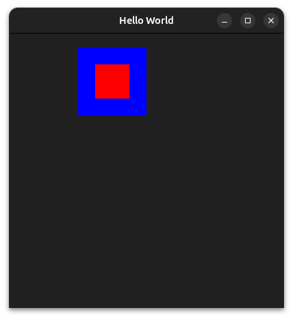
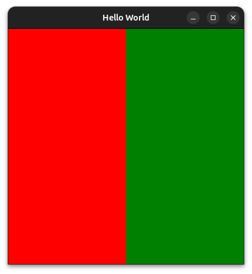

## Basic positioning

There is different way to define the position and the size of items in QML, some are simpler than others, some are more automatic than others. Let's start  with the basics.

### x, y, width, height

In the previous exemple you noticed we used *x*, *y*, *width* and *height*. These are pretty straight forward, they define the position of an Item **relative to its parent**. The (0,0) point is in the top left corner. The following qml exemple should speak for itself.
```qml
ApplicationWindow {
    id: root

    title: "Hello World"
    visible: true
    width: 400
    height: 400
    color: "#202020"

    Rectangle {
        x: 100
        y: 20
        height: 100
        width: 100
        color: "blue"

        Rectangle {
            x: 25
            y: 25
            height: 50
            width: 50
            color: "red"
        }
    }
}
```
This produce the following window:



```admonish note "The color property"
Note that we used the *color* property two different ways here. The first one was by giving an hexadecimal value (`"#202020"`), the second one was by giving a svg color name (`"red"`). You can find the full documentation for color [here](https://doc.qt.io/qt-6/qml-color.html).
```

### Exercice 1
This is a good time to start practicing. The proposal here, is to reproduce the following window in QML, an exemple of how to achieve it will be given at the end of chapter. Feel free to experiment and to try own ideas.
Window to reproduce:


## Anchors
You probably already though that is a quite poor way to set the position and size of item. Indeed, this is clearly not *responsive*. 