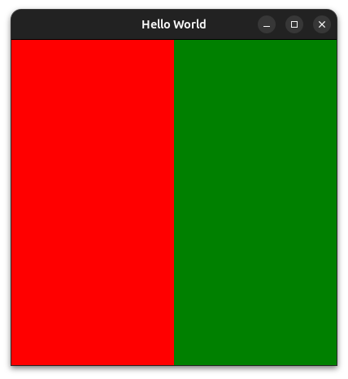
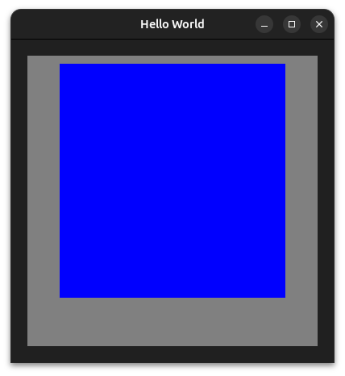

# Basic positioning

There are different ways to define the position and the size of items in QML, some are simpler than others, some are more automatic than others, each one has its own use cases. Let's start with the basics.

## x, y, width, height

In the previous example you noticed we used *x*, *y*, *width* and *height*. These are pretty straight forward: *x* and *y* define the position of an Item **relative to its parent**, while *width* and *height* define its size. The (0,0) point is in the top left corner. The following qml example should speak for itself.
```qml
import QtQuick
import QtQuick.Controls

ApplicationWindow {
    id: root

    width: 400
    height: 400

    title: "Hello World"
    visible: true
    color: "#202020"

    Rectangle {
        x: 100
        y: 20
        height: 100
        width: 100

        color: "blue"

        Rectangle {
            x: 25
            y: 25
            height: 50
            width: 50

            color: "red"
        }
    }
}
```
This produces the following window:


```admonish note "The color property"
Note that we used the *color* property two different ways here. The first one was by giving a hexadecimal value (`"#202020"`), the second and third ones were by giving an SVG color name (`"red"`). You can find the full documentation for color [here](https://doc.qt.io/qt-6/qml-color.html).
```

Here is a second window, built with nothing more than the four properties we just saw:



The code is given below, but it is folded away on purpose: you now know everything needed to write it yourself, so have a go at it first if you feel like it.

````admonish abstract "Show the code"
```qml
import QtQuick
import QtQuick.Controls

ApplicationWindow {
    id: root

    width: 400
    height: 400

    title: "Hello World"
    visible: true
    color: "#202020"

    Rectangle {
        x: 0
        y: 0
        height: 400
        width: 200

        color: "red"
    }
    Rectangle {
        x: 200
        y: 0
        height: 400
        width: 200

        color: "green"
    }
}
```
````


## Anchors
You probably already thought that this is a quite poor way to set the position and size of an item, and that it will not suffice for the majority of the use cases. Indeed, this is clearly not *responsive*. The first alternative is the **anchors**.

Basically, **anchors** are a way to say "The left of this item will be glued to the right of that item", "This item will fill its parent" or "This item will be centered in its parent".


The **anchors** allow you to bind an anchor line of an item to an anchor line of another item (its parent or a sibling).

There are 7 anchor lines: left, horizontalCenter, right, top, verticalCenter, bottom and baseline. Baseline is rarely used so we will not detail it here. You can see the location of the 6 first anchor lines in the following picture (taken from the [Qt website](https://doc.qt.io/qt-6/qtquick-positioning-anchors.html)).


```admonish warning "You can only anchor to a parent or a sibling"
For performance reasons, an item can only be anchored to its **direct parent** or to one of its **siblings**. Anchoring to a grandparent, to a cousin, or to any other item of the file is invalid: the anchor is ignored and Qt prints the runtime warning `Cannot anchor to an item that isn't a parent or sibling`.

This is by far the most common mistake made with anchors. When you hit it, the fix is usually to anchor in two steps through the common ancestor, or to restructure your items a little.
```

When two edges are anchored together, they touch by default. If you want to keep some space between them, use the `margins` group property: `anchors.margins` sets the same margin on every anchored edge at once, while `anchors.leftMargin`, `anchors.topMargin`, `anchors.rightMargin` and `anchors.bottomMargin` let you control each side individually.

```admonish note "Margins only apply to anchored edges"
A margin only has an effect on an edge that is actually anchored. As the Qt documentation puts it, *"anchor margins only apply to anchors; they are not a generic means of applying margins to an Item"*. Setting `anchors.margins` on an item positioned with `x` and `y` does strictly nothing.
```

```qml
import QtQuick
import QtQuick.Controls

ApplicationWindow {
    id: root

    width: 400
    height: 400

    title: "Hello World"
    visible: true
    color: "#202020"

    Rectangle {
        // The same margin on every anchored edge
        anchors.fill: parent
        anchors.margins: 20

        color: "gray"

        Rectangle {
            // A different margin for each edge
            anchors.fill: parent
            anchors.topMargin: 10
            anchors.leftMargin: 40
            anchors.rightMargin: 40
            anchors.bottomMargin: 60

            color: "blue"
        }
    }
}
```
This produces the following window:



### Anchoring shortcuts
Two combinations of anchors are so common that QML provides a shortcut for them:
- `anchors.fill` anchors all 4 sides at once, making the item exactly cover its target.
- `anchors.centerIn` anchors both the horizontal and vertical centers at once, centering the item on its target.

```qml
import QtQuick
import QtQuick.Controls

ApplicationWindow {
    id: root

    width: 400
    height: 400

    title: "Hello World"
    visible: true
    color: "#202020"

    Rectangle {
        // Same as anchoring top, bottom, left and right to parent
        anchors.fill: parent

        color: "blue"

        Rectangle {
            // Same as anchoring horizontalCenter and verticalCenter to parent
            anchors.centerIn: parent
            width: 50
            height: 50

            color: "red"
        }
    }
}
```

With this new concept, we can go back to our two rectangles and make them responsive.
```qml
import QtQuick
import QtQuick.Controls

ApplicationWindow {
    id: root

    width: 400
    height: 400

    title: "Hello World"
    visible: true
    color: "#202020"

    Rectangle {
        id: rectangleLeft

        anchors.top: parent.top
        anchors.bottom: parent.bottom
        anchors.left: parent.left
        width: 200

        color: "red"
    }

    Rectangle {
        anchors.top: parent.top
        anchors.bottom: parent.bottom
        anchors.left: rectangleLeft.right
        anchors.right: parent.right

        color: "green"
    }
}
```
This gives the same window as before, with one big difference: try resizing it. The green rectangle now follows the right edge of the window, whereas the previous version kept two fixed 200 pixel wide rectangles whatever the size of the window.

````admonish tip "Grouping properties"
When several properties belong to the same group, like the anchors we just saw, QML lets you set them either one by one with dots, or all together using braces. The following two snippets are strictly equivalent:
```qml
Rectangle {
    anchors.top: parent.top
    anchors.left: parent.left
    anchors.right: parent.right
}
```
```qml
Rectangle {
    anchors {
        top: parent.top
        left: parent.left
        right: parent.right
    }
}
```
The braces syntax is often preferred when you set several properties of the same group, as it avoids repeating the group name and keeps things visually together. This is not specific to **anchors**: other group properties such as **font** or **border** can be used the same way.
````

```admonish warning "Never mix anchors and explicit positioning"
Using anchors affects the x, y, width and height properties of an item, depending on which anchor lines are used. For example, anchoring both `left` and `right` will drive both `x` and `width`, while anchoring only `top` will drive `y`.

Because of this, anchors and absolute positioning **cannot be mixed for the same dimension**. If an item sets `x` and also sets `anchors.left`, or anchors its `left` and `right` edges but additionally sets a `width`, the result is *undefined*. There is no rule saying which of the two wins, so whatever you observe on your machine is not something you can rely on. The same goes for `y` and `height` together with `anchors.top`/`anchors.bottom`, or for `anchors.fill` together with `width` or `height`.

Pick one of the two approaches for a given dimension, and stick to it.
```

## Column and Row
Anchors are great to describe relationships between a few items, but they quickly become tedious when you simply want to stack a list of items one after the other. For this, QtQuick provides two simple *positioners*: **Column** and **Row**.

A **Column** places its children one below the other, in the order they are declared. A **Row** does the same but places its children side by side, horizontally. Both accept a `spacing` property to control the gap between children.

```qml
import QtQuick
import QtQuick.Controls

ApplicationWindow {
    id: root

    width: 400
    height: 400

    title: "Hello World"
    visible: true
    color: "#202020"

    Column {
        anchors.fill: parent
        spacing: 10

        Rectangle {
            width: 100
            height: 100
            color: "red"
        }
        Rectangle {
            width: 100
            height: 100
            color: "green"
        }
        Rectangle {
            width: 100
            height: 100
            color: "blue"
        }
    }
}
```

This produces the following window:


**Column** and **Row** are the two simplest positioners of QtQuick, but they are not the only ones: **Grid** arranges its children in a two dimensional grid, and **Flow** places them one after the other, wrapping to a new line when it runs out of space. Everything said here applies to those two as well.

```admonish warning "Do not anchor the children of a Column or a Row"
A positioner takes care of placing its children itself, so a child must not fight it. Inside a **Column**, a child should not set its `y` position nor anchor itself vertically, which rules out `anchors.top`, `anchors.bottom`, `anchors.verticalCenter`, `anchors.fill` and `anchors.centerIn`. Inside a **Row**, the same holds for `x` and for the horizontal anchors.

Anchoring the positioner **itself** is perfectly fine, as we did above with `anchors.fill: parent`. It is only its direct children that are constrained. And a child may still anchor in the *other* direction: inside a **Column**, setting `anchors.horizontalCenter` on a child is allowed and quite common.
```

```admonish note "Column/Row vs Layouts"
Do not confuse **Column**/**Row** with **ColumnLayout**/**RowLayout** from **QtQuick.Layouts**. The positioners seen here only place their children one after the other, at the size the children already have. **Layouts**, covered in a later chapter, can additionally resize their children to make the best use of the available space. Prefer **Column**/**Row** for a simple, static list of items, and **Layouts** when items need to grow or shrink with their container.
```

```admonish tip "Time to practice"
This is a good time to pause and experiment on your own. Take the two rectangles from the beginning of the chapter and rebuild them with a **Row** instead of `x` and `width`. Play with `spacing`, drop a **Text** inside a **Rectangle** and center it with `anchors.centerIn`, nest a **Column** inside one of the rectangles, resize the window and watch what follows and what does not.

There is no single right answer here, and nothing to hand in. The goal is simply to get a feel for the three techniques and for when each of them is the comfortable one. A more complete exercise will come in a later chapter, once we have a few more tools at hand.
```
