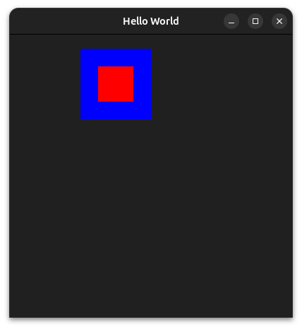
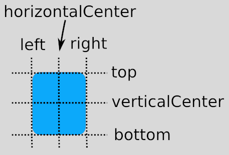

## Basic positioning

There are different ways to define the position and the size of items in QML, some are simpler than others, some are more automatic than others, each one has its own use cases. Let's start with the basics.

### x, y, width, height

In the previous exemple you noticed we used *x*, *y*, *width* and *height*. These are pretty straight forward, they define the position of an Item **relative to its parent**. The (0,0) point is in the top left corner. The following qml exemple should speak for itself.
```qml
ApplicationWindow {
    id: root

    width: 400
    height: 400

    title: "Hello World"
    visible: true
    color: "#202020"

    Rectangle {
        x: 100
        y: 20
        height: 100
        width: 100

        color: "blue"

        Rectangle {
            x: 25
            y: 25
            height: 50
            width: 50

            color: "red"
        }
    }
}
```
This produces the following window:



```admonish note "The color property"
Note that we used the *color* property two different ways here. The first one was by giving an hexadecimal value (`"#202020"`), the second and third ones were by giving a svg color name (`"red"`). You can find the full documentation for color [here](https://doc.qt.io/qt-6/qml-color.html).
```

### Exercice 1
Even though it does not seem much, this is a good time to start practicing simple exercices. The proposal here, is to reproduce the following window in QML.  An exemple of how to achieve it will be given right afterward. Feel free to experiment and to try own ideas.
Window to reproduce:


````admonish abstract "Exercice solution"
```qml
import QtQuick
import QtQuick.Controls

ApplicationWindow {
    id: root

    width: 400
    height: 400

    title: "Hello World"
    visible: true
    color: "#202020"

    Rectangle {
        x: 0
        y: 0
        height: 400
        width: 200

        color: "red"
    }
    Rectangle {
        x: 200
        y: 0
        height: 400
        width: 200

        color: "green"
    }
}
```
````


## Anchors
You probably already thought that this is a quite poor way to set the position and size of an item, and that it will not suffice for the majority of the use cases. Indeed, this is clearly not *responsive*. The first alternative is the **anchors**.

Basically, **anchors** are a way to say "The left of this item will be glued to the right of that item", "This item will fill its parent" or "This item will be centered in its parent".


The **anchors** allow you to bind an anchor line of an item to an anchor line of another item (its parent or a sibling).

There are 7 anchor lines: left, horizontalCenter, right, top, verticalCenter, bottom and baseline. Baseline is rarely used so we will not detail it here. You can see the location of the 6 first anchor lines in the following picture (taken from the [QT website](https://doc.qt.io/qt-6/qtquick-positioning-anchors.html)).



When two edges are anchored together, they touch by default. If you want to keep some space between them, use the `margins` group property: `anchors.margins` sets the same margin on every anchored edge at once, while `anchors.leftMargin`, `anchors.topMargin`, `anchors.rightMargin` and `anchors.bottomMargin` let you control each side individually.

```qml
import QtQuick
import QtQuick.Controls

ApplicationWindow {
    id: root

    width: 400
    height: 400

    title: "Hello World"
    visible: true
    color: "#202020"

    Rectangle {
        // The same margin on every anchored edge
        anchors.fill: parent
        anchors.margins: 20

        color: "gray"

        Rectangle {
            // A different margin for each edge
            anchors.fill: parent
            anchors.topMargin: 10
            anchors.leftMargin: 40
            anchors.rightMargin: 40
            anchors.bottomMargin: 60

            color: "blue"
        }
    }
}
```
This produces the following window:


### Anchoring shortcuts
Two combinations of anchors are so common that QML provides a shortcut for them:
- `anchors.fill` anchors all 4 sides at once, making the item exactly cover its target.
- `anchors.centerIn` anchors both the horizontal and vertical centers at once, centering the item on its target.

```qml
Rectangle {
    // Same as anchoring top, bottom, left and right to parent
    anchors.fill: parent

    color: "blue"
}

Rectangle {
    // Same as anchoring horizontalCenter and verticalCenter to parent
    anchors.centerIn: parent
    width: 50
    height: 50

    color: "red"
}
```

With this new concept, we can improve our last exercice and make it responsive. 
```qml
import QtQuick
import QtQuick.Controls

ApplicationWindow {
    id: root

    width: 400
    height: 400

    title: "Hello World"
    visible: true
    color: "#202020"

    Rectangle {
        id: rectangleLeft

        anchors.top: parent.top
        anchors.bottom: parent.bottom
        anchors.left: parent.left
        width: 200

        color: "red"
    }
    
    Rectangle {
        anchors.top: parent.top
        anchors.bottom: parent.bottom
        anchors.left: rectangleLeft.right
        anchors.right: parent.right

        color: "green"
    }
}
```

````admonish tip "Grouping properties"
When several properties belong to the same group, like the anchors we just saw, QML lets you set them either one by one with dots, or all together using braces. The following two snippets are strictly equivalent:
```qml
Rectangle {
    anchors.top: parent.top
    anchors.left: parent.left
    anchors.right: parent.right
}
```
```qml
Rectangle {
    anchors {
        top: parent.top
        left: parent.left
        right: parent.right
    }
}
```
The braces syntax is often preferred when you set several properties of the same group, as it avoids repeating the group name and keeps things visually together. This is not specific to **anchors**: other group properties such as **font** or **border** can be used the same way.
````

```admonish warning "The effect of the anchors"
Using anchors affects the x, y, width and height properties of an item, depending on which anchor lines are used. For example, anchoring both `left` and `right` will drive both `x` and `width`, while anchoring only `top` will drive `y`.

If you set both an anchor and an explicit `x`, `y`, `width` or `height` for the same dimension on the same item, **the anchor takes precedence**: the explicit value will be overridden. Avoid mixing the two for the same dimension, it will only make the item's behavior harder to predict.
```

## Column and Row
Anchors are great to describe relationships between a few items, but they quickly become tedious when you simply want to stack a list of items one after the other. For this, QtQuick provides two simple *positioners*: **Column** and **Row**.

A **Column** places its children one below the other, in the order they are declared. A **Row** does the same but places its children side by side, horizontally. Both accept a `spacing` property to control the gap between children.

```qml
import QtQuick
import QtQuick.Controls

ApplicationWindow {
    id: root

    width: 400
    height: 400

    title: "Hello World"
    visible: true
    color: "#202020"

    Column {
        anchors.fill: parent
        spacing: 10

        Rectangle {
            width: 100
            height: 100
            color: "red"
        }
        Rectangle {
            width: 100
            height: 100
            color: "green"
        }
        Rectangle {
            width: 100
            height: 100
            color: "blue"
        }
    }
}
```

```admonish note "Column/Row vs Layouts"
Do not confuse **Column**/**Row** with **ColumnLayout**/**RowLayout** from **QtQuick.Layouts**. The positioners seen here only place their children one after the other, at the size the children already have. **Layouts**, covered in a later chapter, can additionally resize their children to make the best use of the available space. Prefer **Column**/**Row** for a simple, static list of items, and **Layouts** when items need to grow or shrink with their container.
```

```admonish tip "Time to practice"
This is a good time to pause and experiment on your own. Try, for instance, to reproduce Exercice 1 again, this time using **anchors** instead of fixed `x`/`width` values, or rebuild it using a **Row** with two Rectangles. You could also try mixing things up: a **Column** anchored to fill its parent, containing a couple of items that are themselves centered or filled with `anchors.centerIn`/`anchors.fill`. There is no single right answer here, the goal is simply to get comfortable switching between these different ways of positioning items.
```