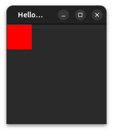
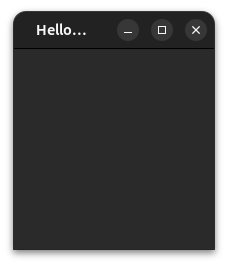

# Implicit sizes

## Default values

Following the first examples, you might ask yourself what happen if you do not set any size to an Item. Let's take the following example (from now on, we will not always write the imports to gain in clarity):

```qml
ApplicationWindow {
    id: root

    width: 200
    height: 200

    title: "Hello world"
    visible: true
    
    Rectangle {
        width: 50
        height: 50

        color: "red"
    }
}
```

Let's run it:



You guessed it: all property have a default value. Here, x and y default to 0. For the a Rectangle, width and height also default to 0 but this is not the case for all widgets, you should understand why by the end of this chapter.

So, if we reproduce the last example, but we remove width and height, the red Rectangle should disapear (or rather it should have a width and height of 0):
```qml
ApplicationWindow {
    id: root

    width: 200
    height: 200

    title: "Hello world"
    visible: true
    
    Rectangle {
        color: "red"
    }
}
```

This produces the following output:



## Implicit Sizes

In qml all widgets have an implicit size (implicitWidth and implicitHeight) and an actual size. The distinction is important to grasp, as this is a very usefull tool to let widget have an automatic sizing, but is also often a source of error when not fully understood.

The implicitWidth of a widget is the **default** width of a widget, and the implicitHeight is of course the **default** height of a widget. Each specific widget should have an implicitWidth that make sense in its context. For example the **implicitWidth** (default width) of a ```Text``` is exactly how much width the text content needs to be fully displayed depending on its font size, boldness, spacing, etc. Similarly the **implicitWidth** of a ```Button``` is the implicit width of the text it contains + an eventual icon + a spacing between the icon and the text + some eventual margins around all that.

We can actualy showcase that by logging the implicitWidth of a Text at its construction:

```qml
Text {
    text: "aa"

    Component.onCompleted: console.log(implicitWidth)
}
```

Gives the output:

```text
15.40625
```

Whereas:

```qml
Text {
    text: "aaaaaaa"

    Component.onCompleted: console.log(implicitWidth)
}
```

Gives the output:

```text
53.921875
```

Here we can see the implicitWidth of a ```Text``` does depends on its content.

So, actually by default the **width** of a Rectangle is not really 0, it is rather equal to the implicitWidth which is itself, for a Rectangle 0.

The implicit sizes (implicitWidth and implicitHeight) should almost nether be modified when using a widget, they should only be defined once when designing the said widget, but then when you want to use it and modify its size, use the plain width and height.

When you will design your own reusable widgets, choosing an appropriate implicit size, but also letting the widget react correctly to a smaller and a larger size will be crucial to make them really usable.