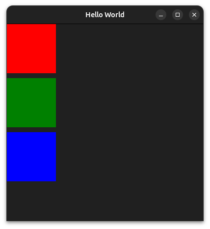

# Column and Row

Anchors are great to describe relationships between a few items, but they quickly become tedious when you simply want to stack a list of items one after the other. For this, QtQuick provides two simple *positioners*: **Column** and **Row**.

A **Column** places its children one below the other, in the order they are declared. A **Row** does the same but places its children side by side, horizontally. Both accept a `spacing` property to control the gap between children.

```qml
ApplicationWindow {
    id: root

    width: 400
    height: 400

    title: "Hello World"
    visible: true
    color: "#202020"

    Column {
        anchors.fill: parent
        
        spacing: 10

        Rectangle {
            width: 100
            height: 100

            color: "red"
        }

        Rectangle {
            width: 100
            height: 100

            color: "green"
        }

        Rectangle {
            width: 100
            height: 100

            color: "blue"
        }
    }
}
```

This produces the following window:



**Column** and **Row** are the two simplest positioners of QtQuick, but they are not the only ones: **Grid** arranges its children in a two-dimensional grid, and **Flow** places them one after the other, wrapping to a new line when it runs out of space. The same principles apply to those two as well.

```admonish warning "Do not anchor the children of a Column or a Row"
A positioner places its children itself, so a child must not fight it. Inside a **Column**, a child must not set its `y` position nor anchor itself vertically, which rules out `anchors.top`, `anchors.bottom`, `anchors.verticalCenter`, `anchors.fill` and `anchors.centerIn`. Inside a **Row**, the same holds for `x` and the horizontal anchors (`anchors.left`, `anchors.right`, `anchors.horizontalCenter`, and again `anchors.fill` and `anchors.centerIn`). Since **Grid** and **Flow** place their children in both directions, their children should not use anchors at all.

Anchoring the positioner **itself** is perfectly fine, as we did above with `anchors.fill: parent`. It is only its direct children that are constrained. And a child may still anchor in the *other* direction: inside a **Column**, setting `anchors.horizontalCenter` on a child is allowed and quite common.
```

Positioners also make good use of what we learned on the previous page: they compute their own implicit size from their children. The `implicitHeight` of a **Column** is the sum of the heights of all its children plus the spacing between them, and its `implicitWidth` is the width of its widest child. A **Row** works the other way around. So a **Column** that is not anchored and has no explicit size automatically takes exactly the space its content needs.


```admonish note "Column/Row vs Layouts"
Do not confuse **Column**/**Row** with **ColumnLayout**/**RowLayout** from **QtQuick.Layouts**. The positioners seen here only place their children one after the other, at the size the children already have. **Layouts**, covered in a later chapter, can additionally resize their children to make the best use of the available space. Prefer **Column**/**Row** for a simple, static list of items, and **Layouts** when items need to grow or shrink with their container.
```

```admonish tip "Time to practice"
This is a good time to pause and experiment on your own. Take the two rectangles from the *Basic positioning* page and rebuild them with a **Row** instead of `x` and `width`. Play with `spacing`, drop a **Text** inside a **Rectangle** and center it with `anchors.centerIn`, nest a **Column** inside one of the rectangles, resize the window and watch what follows and what does not.

There is no single right answer here, and nothing to hand in. The goal is simply to get a feel for the three techniques and for when each of them is the comfortable one. A more complete exercise will come in a later chapter, once we have a few more tools at hand.
```