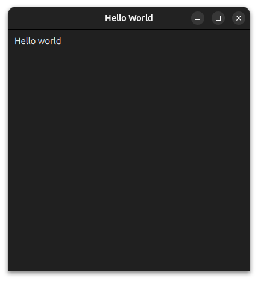

## Your first application

If the previous chapter went well, you should already have a working QML application. Let's start here by dissecting the main QML file.

### Main.qml

Here is an exemple of a an "Hello world" in QML (it might differ a bit from the exemple you got in the last chapter):
```qml
import QtQuick
import QtQuick.Controls

ApplicationWindow {
    id: root

    title: "Hello World"
    visible: true
    width: 400
    height: 400
    color: "#202020"

    Text {
        x: 10
        y: 10
        text: "Hello world"
        color: "white"
    }
}
```
#### The imports
As in many programming language each QML file start by the imports. Qt provide several modules that can be imported to use different items in a QML file. Of course, you can create your own module, but this will be the subject of a later chapter.

The main qml modules to know are:
- **QtQuick**: The essential primitives such as **Rectangle**, **Text** or **Image** and a few *Positioner* like **Column** or **Row** (more on that in an incoming chapter)
- **QtQuick.Controls**: A large set of common controls like **Button**, **Slider**, **ProgressBar** (The completed list can be found [here](https://doc.qt.io/qt-6/qtquickcontrols-index.html#controls))
- **QtQuick.Layouts**: A set of QML types used to arrange and resize items.

In our exemple, we imported **QtQuick** to use **Text** and **QtQuick.Controls** to use **ApplicationWindow**.

#### The root object
Next, we've got an object at the root, here it is **ApplicationWindow**. Each QML file must have one single object at its root.

```admonish info "Item vs Object"
Note that an **Item** and an **Object** in QML are two different things. An **Object** (the actual type being **QtObject**) is the base type for everything. An **Item** (that inherit from QtObject) is the base type for every **visual** objects, it contains all of the common attributes such as x, y, width, height, etc.
```

#### The properties
Every object has a set of attributes, some exist by default and can be customized (like the property "text" for a button), but one can add as many attribute as it want to any QML object.

There is different types of attribute, we will not dig too deep in all of them for this chapter, nevertheless here is the available list:
- the **id** attribute
- **property**
- **signal**
- **signal handler**
- **functions**
- **attached properties** and **attached signal handler**
- **enumeration**
- **child object**
- **inline component**

````admonish tip "Organizing your files"
We highly recommand that you organize the content of your files tightly from the start, to make things easier to find and modify. This will prove usefull especially when files become larger. Everyone has its own way of organizing a file, most of them are probably valid; what we propose is:
```qml
RootItem {
    id: root // always name the root item "root"

    // The signals
    signal mySignal()

    // The enums
    enum MyEnum { First = 0, Second = 1}

    // The properties relative to size or positioning
    x: 5
    width: 200

    // The other properties
    color: "red"

    // The signal handlers
    onWidthChanged: console.log("width");

    // The child objects
    Rectangle {

    }

    // The functions
    function myFunction() {

    }

    // The inline components
    component MyLocalLabel : Label {
        color: "chartreuse"
    }
}
```
````
So here, we set a couple of properties for the root item:
- title: the title of the window
- visible: whether it should be displayed
- width: it's width
- height: you guess it, it's height
- color: the background color

Then we added an item (specifically a **Text**) as a child of the root object; and we set some properties for this text (namely x, y, text and color).

Note that the property **id** is not mandatory (we set it for the ApplicationWindow but not for the Text).

If all went well, you should obtain the following window:



```admonish warning "The visible property"
Do not forget to set the `visible` property to true. For some reason its default is `false`, hence by default the window will not be visible.
```