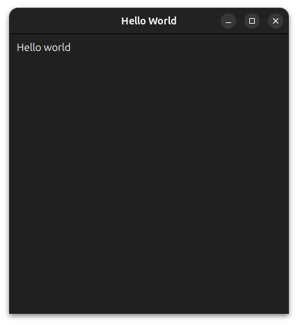

# Your first application

If the previous chapter went well, you should already have a working QML application. Let's start here by dissecting the main QML file.

## Main.qml

Here is an example of a "Hello world" in QML (it might differ a bit from the example you got in the last chapter):
```qml
import QtQuick
import QtQuick.Controls

ApplicationWindow {
    id: root

    title: "Hello World"
    visible: true
    width: 400
    height: 400
    color: "#202020"

    Text {
        x: 10
        y: 10
        text: "Hello world"
        color: "white"
    }
}
```
### The imports
As in many programming languages each QML file starts with the imports. Qt provides several modules that can be imported to use different items in a QML file. Of course, you can create your own module, but this will be the subject of a later chapter.

The main QML modules to know are:
- **QtQuick**: The essential primitives such as **Rectangle**, **Text** or **Image** and a few *Positioners* like **Column** or **Row** (more on that in an incoming chapter)
- **QtQuick.Controls**: A large set of common controls like **Button**, **Slider**, **ProgressBar** (The complete list can be found [here](https://doc.qt.io/qt-6/qtquickcontrols-index.html#controls))
- **QtQuick.Layouts**: A set of QML types used to arrange and resize items.

In our example, we imported **QtQuick** to use **Text** and **QtQuick.Controls** to use **ApplicationWindow**.

### The root object
Next, we've got an object at the root, here it is **ApplicationWindow**. Each QML file must have one single object at its root.

```admonish info "Item vs Object"
Note that an **Item** and an **Object** in QML are two different things. An **Object** (the actual type being **QtObject**) is the base type for everything. An **Item** (that inherits from QtObject) is the base type for every **visual** object, it contains all of the common attributes such as x, y, width, height, etc.
```

### The properties
Every object has a set of attributes, some exist by default and can be customized (like the property "text" for a button), but one can add as many attributes as one wants to any QML object.

There are different types of attribute, we will not dig too deep in all of them for this chapter, nevertheless, here is the available list:
- the **id** attribute
- **properties**
- **signals**
- **signal handlers**
- **functions**
- **attached properties** and **attached signal handlers**
- **enumerations**
- **child objects**
- **inline components**

````admonish tip "Organizing your files"
We highly recommend that you organize the content of your files tightly from the start, to make things easier to find and modify. This will prove useful especially when files become larger. Everyone has their own way of organizing a file, most of them are probably valid. Here is what we propose (you will probably not understand the following content yet but this is not a problem):
```qml
RootItem {
    id: root // always name the root item "root"

    // The signals
    signal mySignal()

    // The enums
    enum MyEnum { First = 0, Second = 1 }

    // Custom properties
    property int myCustomProperty: 10

    // The properties relative to size or positioning
    x: 5
    width: 200

    // The other properties
    color: "red"

    // The signal handlers
    onWidthChanged: console.log("width")

    // The child objects
    Rectangle {

    }

    // The functions
    function myFunction() {

    }

    // The inline components
    component MyLocalLabel : Label {
        color: "chartreuse"
    }
}
```
````

Now, back to our Main.qml example. Here, we set a couple of properties for the root item:
- title: the title of the window
- visible: whether it should be displayed
- width: its width
- height: you guessed it, its height
- color: the background color

Then we added an item (specifically a **Text**) as a child of the root object, and we set some properties for this text (namely x, y, text and color).

Note that the **id** attribute is not mandatory (we set it for the ApplicationWindow but not for the Text).

If all went well, you should obtain the following window:



```admonish warning "The visible property"
Do not forget to set the `visible` property to true. Its default is `false`, so the window will not be visible unless you set it explicitly.
```

## Referring to other objects

Two things in the example above deserve a closer look, because you will meet them constantly starting with the very next chapter.

The **id** attribute gives an object a name that the rest of the file can use to refer to it. It is not a property, and it is not a string: it is an identifier, it must begin with a lowercase letter, and it must be unique within the file. Once an object has an id, any other object in the same file can read its properties:

```qml
Rectangle {
    id: background

    width: 200
}

Text {
    text: "I am as wide as the background"
    width: background.width
}
```

Every visual object also has a **parent**: the object it is declared inside. QML gives you the `parent` keyword to refer to it without having to name it, which is convenient because an item usually cares about *its parent's size*, not about its parent's name. In our Main.qml, the parent of the **Text** is the **ApplicationWindow**.

```admonish info "Properties are bound, not assigned"
In the snippet above, `width: background.width` does not copy the value of `background.width` once and for all. It creates a **binding**: from then on, whenever `background.width` changes, the width of the **Text** changes with it, by itself, with no extra code.

This is the single most important idea in QML, and it holds for any property whose value is an expression involving other properties. We will come back to bindings in detail in a later chapter. For now, read `a: b.c` as "*a follows b.c*" rather than "*a is set to b.c*".
```
