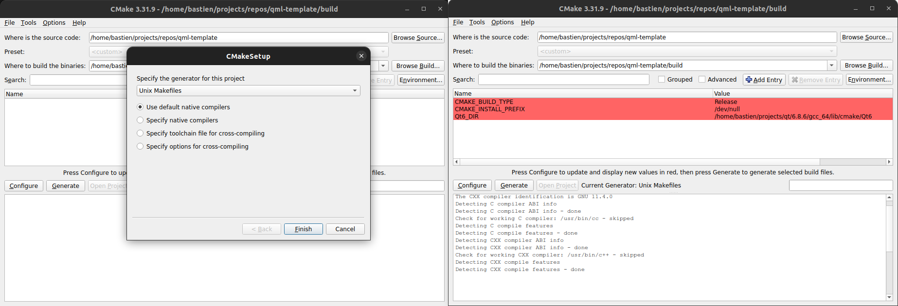

# Minimal CMake

In order to generate the project, we will use cmake. This tool will generate a build system of your choice using configuration files named `CMakeLists.txt`.

You can launch cmake using the basic command `cmake`, or use the GUI apps like `ccmake` or `cmake-gui`.

## Requirements

You will need:
- A cmake installation ([supported versions](https://doc.qt.io/qt-6/cmake-supported-cmake-versions.html))
- An install of Qt 6 (you can find the installer on the [qt website](https://doc.qt.io/qt-6/qt-online-installation.html))
- A compiler ([supported versions](https://doc.qt.io/qt-6/supported-platforms.html))

The version 6 of Qt requires at least c++17, in the following example we will ask for c++20 because why not.

## Minimal cmake project

First we will need to initialize the cmake project.

````admonish info "Folder structure"

Technically, for a minimum project need only a single `CMakeFile.txt` and your source files.
But for this project, we propose the following structure:

```
qml-template
    |- CMakeLists.txt #will be called the `root CMakeLists`
    |- src
        |- CMakeLists.txt
        |- qmlApp
            |- app
            |- assets
            |- widgets
            |- CMakeLists.txt #will be called the `app CMakeLists`

```

This structure will be used all along this course, but feel free to use your own.

````

To do that, we need at least the following lines in the `root CMakeLists`:

```cmake
cmake_minimum_required(VERSION 3.21)

project(qml-template LANGUAGES C CXX VERSION 1.0.0)
```

You will also need to have at least a library or an executable, but we will see that in the next part.

## Find Qt

As any other third parties, we will need to first find it using a `find_package`.

To do that, you can add the following line in the root CMakeLists

```cmake
find_package(Qt6 6.8 REQUIRED COMPONENTS Core Qml Quick Widgets)
```

If Qt is not found, you will have to set the `Qt6_DIR` manually.

```admonish note "How to set the Qt6_DIR"
Usually the path is `/path/to/qt/dir/{qt_version}/{compiler}/lib/cmake/Qt6`.

With `qt_version` the full version (ex: 6.8.6) and `compiler` the name of the compiler used (ex: gcc_64)

To set it  in the cmake build, you can either:
- Use **cmake-gui**



- Add the option in the cmake command:
> cmake . -DQt6_DIR=/path/to/qt/dir/{qt_version}/{compiler}/lib/cmake/Qt6
```

## Setup project

Once the library is found, we will need to call `qt_standard_project_setup` in order to set the default values of some cmake variables (see the full list [here](https://doc.qt.io/qt-6.8/qt-standard-project-setup.html#description))

Thanks to this function, we no longer need to set `CMAKE_AUTOMOC` or `CMAKE_AUTOUIC` as we did when using Qt5.

```admonish
This function will also include `GNUInstallDirs`
```

````admonish example "Example"
In the end, here is the full content of the root CMakeLists:

```cmake
cmake_minimum_required(VERSION 3.21)

project(qml-template LANGUAGES C CXX VERSION 1.0.0)

set(CMAKE_CXX_STANDARD 20) #Qt6 requires at least cpp17
set(CMAKE_CXX_STANDARD_REQUIRED ON)

find_package(Qt6 6.8 REQUIRED COMPONENTS Core Qml Quick Widgets)
if(Qt6_FOUND)
    message(STATUS "Qt found, version ${Qt6_VERSION}")
    qt_standard_project_setup(REQUIRES 6.8)
endif()
```
````

````admonish note "Note"
If you followed the proposed folder structure, you will need to add another line:

```cmake
add_subdirectory(src)
```

This line will notify cmake that there is a CMakeLists in the given folder (here the src folder)

So this gives us the following code:

```cmake
cmake_minimum_required(VERSION 3.21)

project(qml-template LANGUAGES C CXX VERSION 1.0.0)

set(CMAKE_CXX_STANDARD 20) #Qt6 requires at least cpp17
set(CMAKE_CXX_STANDARD_REQUIRED ON)

find_package(Qt6 6.8 REQUIRED COMPONENTS Core Qml Quick Widgets)
if(Qt6_FOUND)
    message(STATUS "Qt found, version ${Qt6_VERSION}")
    qt_standard_project_setup(REQUIRES 6.8)
endif()

add_subdirectory(src)
```
````