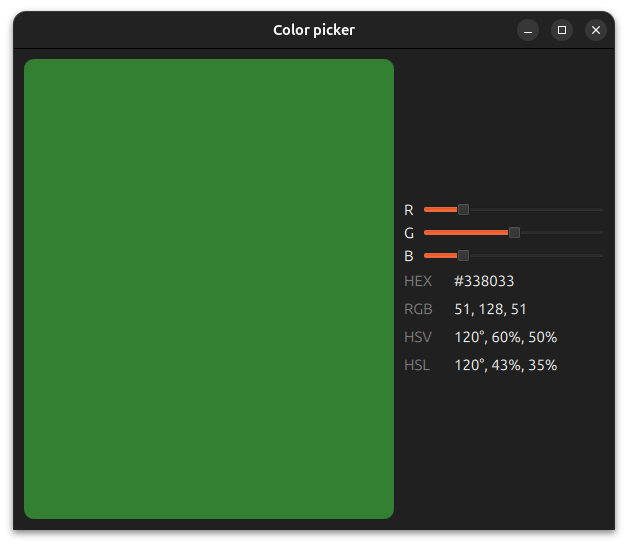
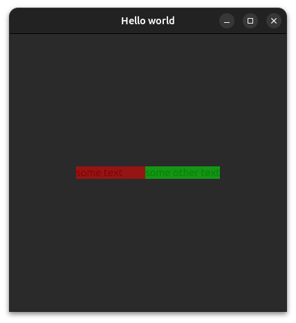
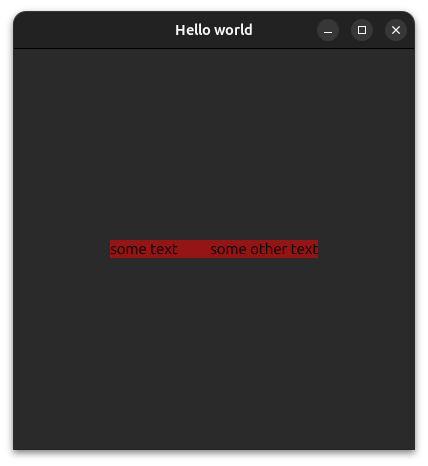

# Exercise: a color picker

Everything you have seen so far (properties, signals, bindings, positioners, etc.) is enough to build something real. This page is that first real thing.

It also comes with a few important tips to debug a scene that does not look exactly the way you want.

## The exercise

Build a color picker:

- The user chooses a color with three sliders, one per channel: red, green and blue.
- A large rectangle shows the resulting color.
- Next to it, the same color is written out in four notations, all updating live as the sliders move:
  - **hex**, as `#RRGGBB`
  - **RGB**, as three values out of 255
  - **HSV** and **HSL**, each as an angle in degrees and two percentages

Everything on screen must derive from the sliders through bindings. If you find yourself writing a handler that assigns a value somewhere, step back: in this exercise, every single readout is a binding.

Feel free to create something else if you find a more appealing exercise!

### What you need

You already know almost everything you need to complete this exercise. Here is what is missing.

**The new type**: [Slider](https://doc.qt.io/qt-6/qml-qtquick-controls-slider.html), from **QtQuick.Controls**. On its page you will find three properties that matter here, `from`, `to` and `value`, and one detail: `from` defaults to `0.0` and `to` to `1.0`. A color channel in QML is also a number between 0 and 1, so a default **Slider** already produces exactly the range you need, with no conversion at all.

**The new value type**: [color](https://doc.qt.io/qt-6/qml-color.html). This is the page worth opening properly, because a `color` exposes its own components as read-only properties, and they are the whole point of this exercise:
- `r`, `g`, `b`, `a`: the RGBA channels
- `hsvHue`, `hsvSaturation`, `hsvValue`: the same color in HSV
- `hslHue`, `hslSaturation`, `hslLightness`: and in HSL

So the HSV and HSL readouts require no computation of your own. Qt already did the conversion: you only have to read the right property and scale it. Hues are normalized to 0–1 like everything else, so multiply by 360 for degrees, and by 100 for the percentages. One trap: for a gray (all three channels equal), the hue is undefined and Qt returns `-1`, so clamp it to 0 before displaying it.

**The one function**: `Qt.rgba(r, g, b, a)` builds a color from four values between 0 and 1.

```admonish tip "Suggested approach"
Declare one property holding the picked color, bound to the three sliders:

    property color pickedColor: Qt.rgba(redSlider.value, greenSlider.value, blueSlider.value, 1)

Then bind everything else to that single property. This keeps one source of truth in the file, and it means adding a fourth notation later is one more `Text`, with nothing else to touch.

For the hex string you will need a small helper, since JavaScript has no built-in `#RRGGBB` formatter: `Math.round(channel * 255).toString(16)` gives you the two digits, but remember it returns a single character for values below 16.
```

Here is what ours looks like:



### Debugging tips

Your application may not look exactly the way you want. There are many ways to debug it and find out what is actually happening. Here are a couple of things you can try.

#### Logging

Logging the sizes, implicit sizes, positions, etc., both when the items are created (`Component.onCompleted: console.log(width)`) and when these properties change (`onWidthChanged: console.log(width)`), helps you understand the actual size of your items and when it changes.

#### Visual debugging

Sometimes it is hard to tell the actual size of an item and where it sits on the screen. One way to see it is to put a semi-transparent **Rectangle** inside it. Here is an example:

```qml
Row {
    anchors.centerIn: parent

    Text {
        text: "some text"
        width: 100

        Rectangle {
            anchors.fill: parent

            color: "#80FF0000" // 80 is semi transparent, FF0000 is red
        }
    }

    Text {
        text: "some other text"

        Rectangle {
            anchors.fill: parent

            color: "#8000FF00" // 80 is semi transparent, 00FF00 is green
        }
    }
}
```



Here the semi-transparent rectangles show the space each text takes.

You cannot do that for a **Column** or a **Row**, because their children cannot use `anchors.fill`. Instead, you can put a **Rectangle** around the positioner and bind the rectangle's implicit size to the positioner's, like so:

```qml
Rectangle {
    anchors.centerIn: parent
    implicitHeight: row.implicitHeight
    implicitWidth: row.implicitWidth

    color: "#80FF0000"

    Row {
        id: row

        anchors.fill: parent

        Text {
            text: "some text"
            width: 100
        }

        Text {
            text: "some other text"
        }
    }
}
```

which gives the following result:



## One solution

There are many ways to arrange this, and the layout is entirely up to you. Here is one complete version.

````admonish abstract "Show the solution"
```qml
import QtQuick
import QtQuick.Controls

ApplicationWindow {
    id: root

    width: 600
    height: 480

    title: "Color picker"
    visible: true
    color: "#202020"

    // The single source of truth: everything else in the file is bound to this
    property color pickedColor: Qt.rgba(redSlider.value, greenSlider.value, blueSlider.value, 1)

    Rectangle {
        anchors {
            top: parent.top
            bottom: parent.bottom
            left: parent.left
            right: column.left
            margins: 10
        }

        radius: 10 // Round corners
        color: root.pickedColor
    }

    Column {
        id: column

        anchors {
            verticalCenter: parent.verticalCenter
            right: parent.right
            margins: 10
        }
        width: 200

        spacing: 10

        // The 3 sliders
        Item {
            // Horizontal anchoring is allowed inside a Column
            anchors {
                left: parent.left
                right: parent.right
            }
            height: redSlider.height

            Text {
                id: rText

                anchors.verticalCenter: parent.verticalCenter
                width: 20

                text: "R"
                color: "white"
            }

            Slider {
                id: redSlider

                anchors {
                    left: rText.right
                    right: parent.right
                }
                value: 0.2
            }
        }

        Item {
            anchors {
                left: parent.left
                right: parent.right
            }
            height: greenSlider.height

            Text {
                id: gText

                anchors.verticalCenter: parent.verticalCenter
                width: 20

                text: "G"
                color: "white"
            }

            Slider {
                id: greenSlider

                anchors {
                    left: gText.right
                    right: parent.right
                }
                value: 0.5
            }
        }

        Item {
            anchors {
                left: parent.left
                right: parent.right
            }
            height: blueSlider.height

            Text {
                id: bText

                anchors.verticalCenter: parent.verticalCenter
                width: 20

                text: "B"
                color: "white"
            }

            Slider {
                id: blueSlider

                anchors {
                    left: bText.right
                    right: parent.right
                }
                value: 0.2
            }
        }

        // The 4 ways to display the color
        Row {
            anchors.left: parent.left

            spacing: 10

            Text {
                width: 40

                text: "HEX"
                color: "#808080"
            }

            Text {
                text: ("#" + root.channelToHex(root.pickedColor.r)
                            + root.channelToHex(root.pickedColor.g)
                            + root.channelToHex(root.pickedColor.b)).toUpperCase()
                color: "white"
            }
        }

        Row {
            anchors.left: parent.left

            spacing: 10

            Text {
                width: 40

                text: "RGB"
                color: "#808080"
            }

            Text {
                text: Math.round(root.pickedColor.r * 255) + ", "
                    + Math.round(root.pickedColor.g * 255) + ", "
                    + Math.round(root.pickedColor.b * 255)
                color: "white"
            }
        }
        
        Row {
            anchors.left: parent.left
            
            spacing: 10

            Text {
                width: 40

                text: "HSV"
                color: "#808080"
            }

            Text {
                text: Math.round(Math.max(0, root.pickedColor.hsvHue) * 360) + "°, "
                    + Math.round(root.pickedColor.hsvSaturation * 100) + "%, "
                    + Math.round(root.pickedColor.hsvValue * 100) + "%"
                color: "white"
            }
        }

        Row {
            anchors.left: parent.left
            
            spacing: 10

            Text {
                width: 40

                text: "HSL"
                color: "#808080"
            }
            
            Text {
                text: Math.round(Math.max(0, root.pickedColor.hslHue) * 360) + "°, "
                    + Math.round(root.pickedColor.hslSaturation * 100) + "%, "
                    + Math.round(root.pickedColor.hslLightness * 100) + "%"
                color: "white"
            }
        }
    }

    function channelToHex(channel) {
        var hex = Math.round(channel * 255).toString(16)
        return hex.length === 1 ? "0" + hex : hex
    }
}
```
````

A few things worth noticing in that solution, because they are the habits this chapter was trying to build:

- **There is not one signal handler in the whole file.** Nothing is ever assigned to anything. Every value on screen is declared once, as a relationship, and the sliders do the rest.
- **`pickedColor` is the only place the three sliders are read.** Everything else depends on `pickedColor` alone, so the day you replace the sliders with something else, one line changes.
- **The slider rows anchor horizontally inside the `Column`**, which is the direction a `Column` leaves free. Anchoring them vertically instead would fight the positioner, exactly as warned in [Simple positioners](../QML_basics/simple_positionners.md).

### Going further

This is a simple program, but it already shows a few things worth improving. Most of them introduce concepts we will detail in later chapters.

#### Uniform spacings and sizes

Many values are repeated here, such as the spacings, which are all equal to 10. Updating them later would be tedious. To fix that, we can declare a single `readonly property int defaultSpacing: 10` at the root and write `root.defaultSpacing` everywhere, so there is only one value to change when the time comes. The same goes for the other repeated values.

#### Reusable components

The slider and its letter ('R', 'G' or 'B') wrapped in an **Item** are repeated three times. This can clearly be improved with reusable components, which will be introduced in the next chapter. A component can live in its own file or be declared directly inside the file that uses it. We can imagine a `ColorSlider` component where we only set the letter, and which exposes a `value` property to read. It could look like this (do not try to understand the code yet):

```qml
component ColorSlider: Item {
    property alias text: sliderText.text
    property alias value: slider.value

    anchors {
        left: parent.left
        right: parent.right
    }
    height: slider.height

    Text {
        id: sliderText

        anchors.verticalCenter: parent.verticalCenter
        width: 20

        text: "R"
        color: "white"
    }

    Slider {
        id: slider

        anchors {
            left: sliderText.right
            right: parent.right
        }
        value: 0.2
    }
}

// The 3 sliders
ColorSlider {
    id: redSlider

    text: "R"
    value: 0.2
}

ColorSlider {
    id: greenSlider

    text: "G"
    value: 0.5
}

ColorSlider {
    id: blueSlider

    text: "B"
    value: 0.2
}
```

#### Using layouts instead of Item
Here we used anchors to make each slider take all the space left after its letter, and the colored rectangle take all the space left by the controls on the right. This is a bit cumbersome to write. An easier way is to use layouts (from `QtQuick.Layouts`), which give their children a `Layout.fillWidth` attached property to take all the remaining space automatically. Our `ColorSlider` would then look like this, which is definitely clearer:

```qml
component ColorSlider: RowLayout {
    property alias text: sliderText.text
    property alias value: slider.value

    anchors {
        left: parent.left
        right: parent.right
    }

    Text {
        id: sliderText

        Layout.alignment: Qt.AlignVCenter

        text: "R"
        color: "white"
    }

    Slider {
        id: slider

        Layout.fillWidth: true
        
        value: 0.2
    }
}
```

Don't worry too much about these suggestions: they are just a sneak peek of what's coming!