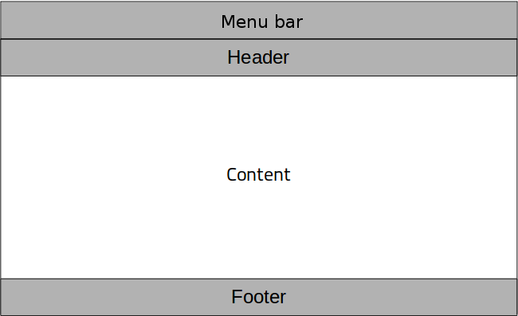

# Visual and non visual components

In qml, you can create and use widgets that are not based on Item.

We will no go through all of them but we will have a look at the most common ones.

## ApplicationWindow/Window

The `ApplicationWindow` is your main window. It has a title, a position, a size.

To fill it with content, you can use the background, menuBar, header, contentItem or footer properties.




```admonish note "Note"
By default, all the widgets are put inside the `contentItem` property.

You can check the `Custom properties` section for more information on default properties.
```

A `Window` is a is a completely separated application window that lives outside of the main `ApplicationWindow`. It works exactly like the main `ApplicationWindow`.

```admonish note "Note"
If you use an opengl renderer, it will have a separated opengl context.
```

## Dialogs/Popup

`Dialog` or `Popup` are windows that only lives inside the main `ApplicationWindow`.

Since they are not inside any item, you can't use the left, right, top and bottom anchors on them.

### Important properties

- `header`, `footer`, `contentItem` and `background`
- `dim`: Whether the window behind the dialog has an black transparent overlay on top when the dialog/popup is opened or not
- `closePolicy`: define the behavior of the dialog/popup when the user clicks outside
- `modal`: Whether the dialog/popup prevents the input events from behind captured by the window below or not

### Difference Dialog/Popup

A dialog is a Popup that has a list of predefined buttons such as "yes", "no", "save", "cancel", ...

## QtObject

`QtObject` is the base of most of the QML objects.

We only use it for one purpose only: to store properties in the root item that should not be accessible by external items.

For example let's take the following widget defined in "MyRect.qml"


```qml
Rectangle {
    id: root

    QtObject {
        id: privateRoot

        property int myProp: 0
    }

    Rectangle {
        id: innerRect
    }
}
```

Here `myProp` is accessible by all the items inside the root item (such as `innerRect`), but if another widget or page uses the `MyRect` widget, they won't be able to access the property.

## Connections

This object is used to create connections to signals with an object only accessible using its id.

For example: 

```qml
Rectangle {
    id: root

    property Button b
}
```

Here we have a button, but the button is define elsewhere. So we need to use the `Connections` widget to connect to its signals.
To connect to it, we specify the target (here b), and then create a slot.

To do that, we only need to define a function named `onMySignalName`. This function will automatically be connected to the signal.

```qml
Rectangle {
    id: root

    property Button b

    Connections {
        target: b

        function onClicked(){
            ...
        }
    }
}
```
