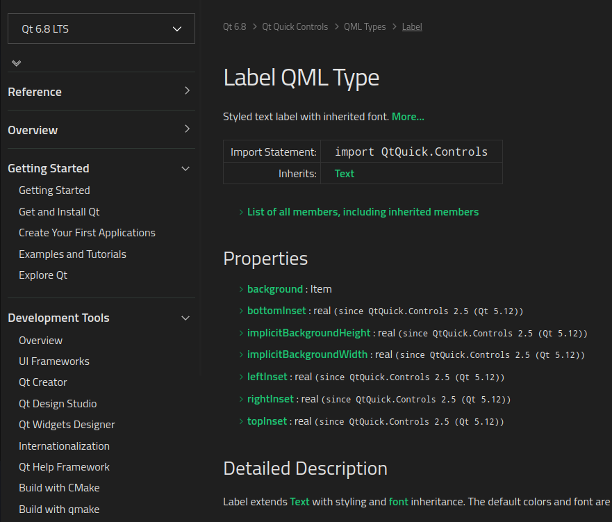

# Existing components

Qt provide lots of qml types, you can check them [here](https://doc.qt.io/qt-6.8/qmltypes.html). It contains all kind of type, visual items, non visual items,...

Among them, there is a family of components named "controls", here is the [list.](https://doc.qt.io/qt-6.8/qtquick-controls-qmlmodule.html)

Let's take the following page:



At the **top left**, you can select the **Qt version**.

**Under the widget name (here `Label`)**, you have the **qml import** to be done in order to use this widget **(here `QtQuick.Controls`)**.

Then you have the **list of the main properties and signals**. But a widget can contain a lot more than these properties. To display them, click on **"List of all members, including inherited members"**.

And finally, you have a **quick description of the widget and some examples**.

```admonish info "Info"
There are experimental widgets in a lib called **Qt.labs**
```